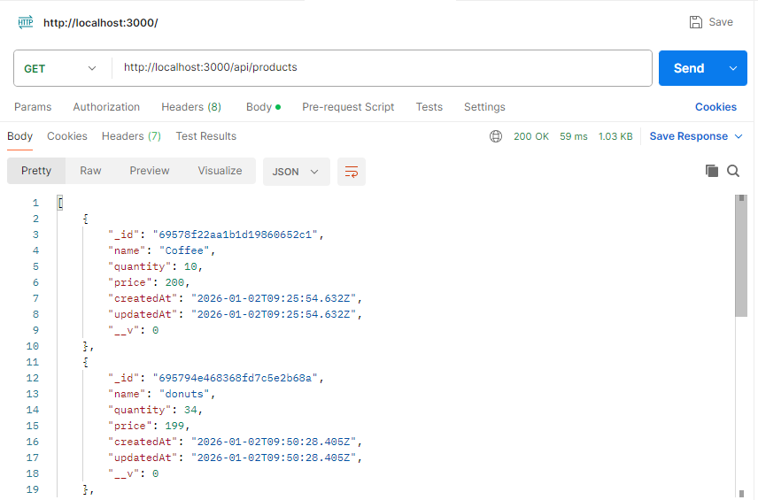
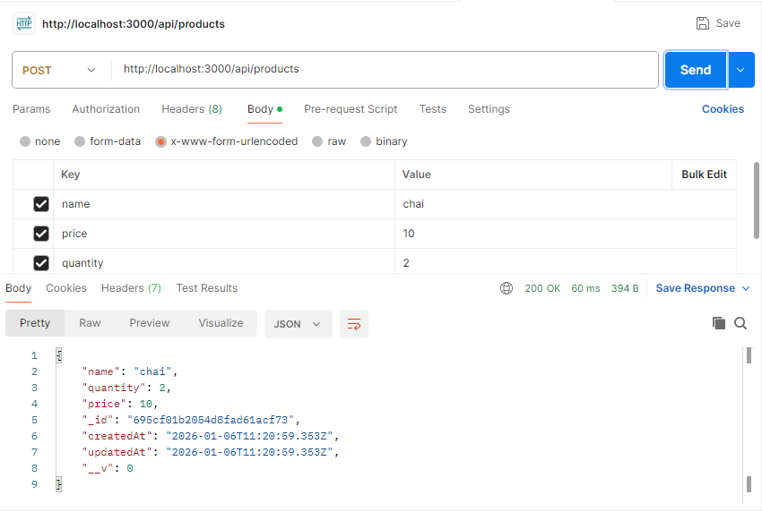
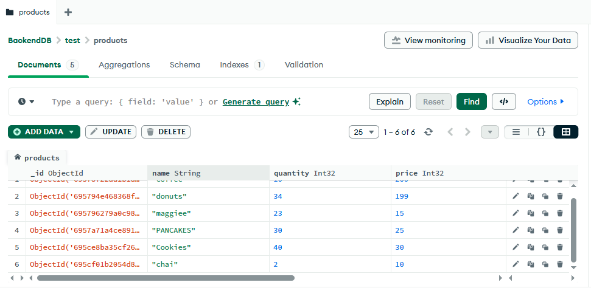
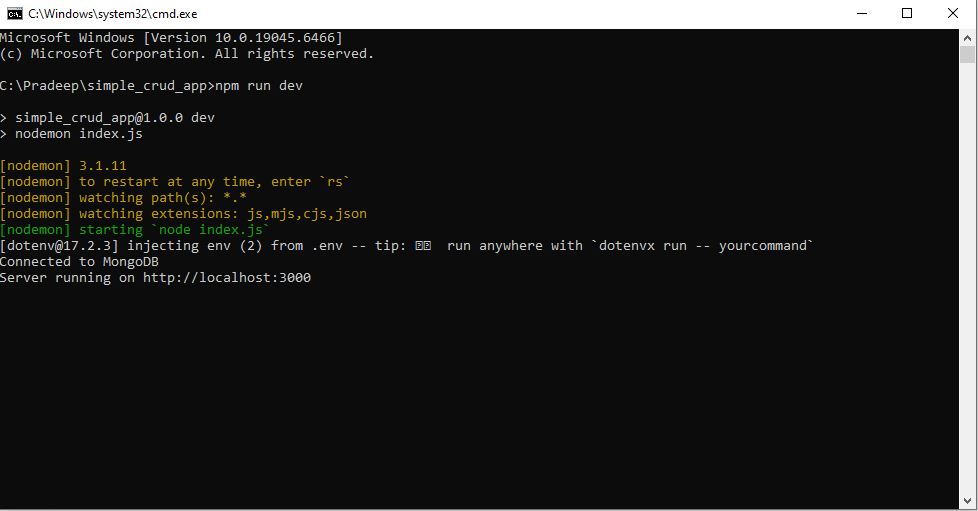

## Product REST API ->

A RESTful API built using Node.js, Express, and MongoDB to perform CRUD operations on products.

## Tech Stack : Node.js, Express, MongoDB Atlas, Mongoose

## Features : Create, read, update, and delete products

## Setup : 
Install dependencies: npm install

Create a .env file with MONGODB_URI and PORT

Run the server: npm run dev

Server runs at http://localhost:3000

## API Base URL ->
/api/products

## Security : Database credentials are managed using environment variables.

## Author : Pradeepsingh Negi

## Screenshots

### Get Products

### Create Product

### MongoDB Collection

### Server Running

